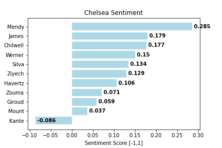
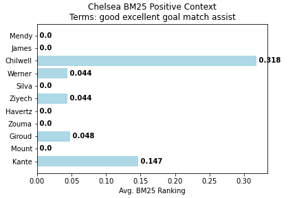
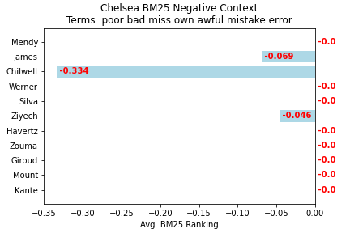

# Sentiment Analysis for Soccer Games and Documentation

### Introduction

The main idea of this repo is to provide the code, documentaion, and demo for a basic sentiment analysis for soccer games using Python, Tweepy, TextBlob, and BM25Okapi. **The easiest way to use this code is to use the Jupyter Notebook demo in this repo.** A video tutorial on Youtube is also provided. The source code is available as well. This was originallyfor my course project for CS 410 Text Information Systems for my Masters in Computer Science at University of Illinois Urbana-Champaign.  Please feel free to reach out to me if you would like to collaborate :) .

#### Files 

YouTube Demo Link: 

maincode.py - The main source code

12_5_20_ChelseaLeeds.ipynb - The demo code / output that was used for the YouTube video tutorial 

demo.ipynb - Empty demo code in Jupyter Notebook for free use

team1_sentiment.png - Example sentiment bar chart for Team 1 (new file will be saved down if main code is run)
team1_BM25positive.png - Example positive BM25 average ranking for Team 1 (new file will be saved down if main code is run)
team1_BM25negative.png - Example negative BM25 average ranking for Team 1 (new file will be saved down if main code is run)

team2_sentiment.png - Example sentiment bar chart for Team 2 (new file will be saved down if main code is run)
team2_BM25positive.png - Example positive BM25 average ranking for Team 2 (new file will be saved down if main code is run)
team2_BM25negative.png - Example negative BM25 average ranking for Team 2 (new file will be saved down if main code is run)

### Background

We will be using Tweepy to source tweets from the Twitter API and TextBlob to provide a framework for natural language processing to provide sentiment analysis. In addition, we will use PyPi's implementation of BM25Okapi to provide context of the sentiment analysis.

Ideally, the result of this code will show the relative sentiment of a player's performance during a recent game. By using wisdom of the crowds, we hope to gain an idea of how the player performed. Using BM25Okapi, we will also be able to use relevant terms to see what might have caused sentiment to go way or another (ex. player scored a goal or provided an assist, etc.) Using PyPlot, we will also be able to visualize the results.

Technically, this code can be used for any soccer game, but given the popularity and language barrier, EPL games are likely to provide the most meaningful results. Adjustments could be made for La Liga or Serie A using Spanish or Italian NLP. Please feel free to reach out as I welcome any collaboration as the code can be improved and applied to different sports or different applications all together :) .

A run through of the source code is provided below. 

### Code Documentation

#### Introduction 

Packages Needed: To begin, we need several packages installed and imported. These are: Tweepy, TextBlob, Numpy, Rank_BM25, and Matplotlib.pyplot. Documentation and links are found here: http://docs.tweepy.org/en/latest/api.html https://textblob.readthedocs.io/en/dev/api_reference.html https://numpy.org/doc/ https://pypi.org/project/rank-bm25/ https://matplotlib.org/3.3.3/api/_as_gen/matplotlib.pyplot.html

Most importantly, we will need access to the Twitter API, which can be gained by having a Twitter profile. You will be provided four keys of strings of letters and numbers which you will need to enter in the box below: consumer key, consumer secret, access token, access token secret. These will be used in the below code area. 

```shell
consumer_key = ""
consumer_secret = ""
access_token = ""
access_token_secret = ""

auth = tweepy.OAuthHandler(consumer_key, consumer_secret)
auth.set_access_token(access_token, access_token_secret)

api = tweepy.API(auth,wait_on_rate_limit=True)
``` 

#### Game Parameters

We will need to set the parameters for the game we are interested in; this includes the two teams names and the starting 11 for each team. 

```shell
team1 = ""
team2 = ""

#team1
team1_Player1 = ""
team1_Player2 = ""
team1_Player3 = ""
team1_Player4 = ""
team1_Player5 = ""
team1_Player6 = ""
team1_Player7 = ""
team1_Player8 = ""
team1_Player9 = ""
team1_Player10 = ""
team1_Player11 = ""

#team2
team2_Player1 = ""
team2_Player2 = ""
team2_Player3 = ""
team2_Player4 = ""
team2_Player5 = ""
team2_Player6 = ""
team2_Player7 = ""
team2_Player8 = ""
team2_Player9 = ""
team2_Player10 = ""
team2_Player11 = ""
```
After setting the game parameters, there are a few algorithm paramters we will need to set. To begin, the number of tweets that we want to retrieve is set as a parameter for the algorithm. This may also affect how quickly the algorithm runs because of limitations in the package and the free version of the Twitter API. The threshold for objectivity/subjectivity is also set. 0 is defined as purely objective and 1 is defined as subjective. Ideally for the most results, we want a low threshold, 0.10 has been suggested, but any threshold can be set. The date periods for when we want to retrieve tweets from is also se; for best results, it is suggested to only use the day of the game and the day after the game. The free version of the Twitter API limits searches to within the 7 days. 

Sentiment Analysis: 

```shell
### define the number of tweets we want to sort for and subjective threshold

number_of_tweets = 100 # how many tweets we want to search for
threshold = 0.10 # threshold for subjectivity [0,1]

### setting date range, ideally run day after the game

date_since = "2020-11-21"
date_until = "2020-11-22"
```

For the BM25Okapi algorithm, there are just two sets of parameters we must set. The first is the set positive terms we want to use for context. Some suggestions are in the default query already. Similarily, for the second set of parameters, it is a set of negative terms. 

BM25Okapi: 

```shell
positive_terms = "assist good excellent great" # search queries, positive terms
negative_terms = "poor bad miss own awful" # negative terms
```

The BM25Okapi portion of the code will combine all of the tweets for every player together which will they treat each tweet as a document as part of a corpus. Then using the positive array, it will then go through each document ranking it based on how many of the positive terms each tweet matches. The higher ranked the tweet is, the more relevant it is to that query. Given we are using positive terms, the idea is that the tweet is more reflective of positive results in relation to those terms during the game for the respective player. The same will be done with the negative query. Once the rankings are done, each players average ranking for each query is provided, similarily to the sentiment array above. These two arrays will then be used for charting.  

BM25 incorporates search ranking concepts such as IDF (inverse document frequency), which is a filter for commonly used terms as well as TF (term frequency), which gives higher ranking for more matching of terms. A brief summary of how exactly the formula ranks can be found here: https://nlp.stanford.edu/IR-book/html/htmledition/okapi-bm25-a-non-binary-model-1.html


#### Running the Code

After setting the above parameters, the entire "maincode.py" can be run which will then output the relevant visualizations for this task. The code will retrieve the set number of tweets for each player and then use TextBlob's sentiment analysis tool to rate the sentiment of each tweet. If the tweet crosses the set threshold, the senitment for that tweet will be used for an average of all of the sentiment for that respective player. This array of sentiments of players will then be used for our graphs below. 

The functions that are used for the generation of these visualizations are listed below. 

#### Visual Output Functions

plot_bar_team1_sentiment(): 

Using pyplot, this function will chart Team 1's senitment by player in the form of a horizontal bar chart. The function will take the sentiment array as mentioned above and plot the respective average for each player. If the sentiment is more towards the right, the player's sentiment for that game will be more positive. If the senitment is more towards the left, the player's sentiment for that game will be more negative. 

plot_bar_team2_sentiment():

Same as the above but with the players for Team 2. 



plot_bar_team1_BM25positive():

Using pyplot again, this function will chart Team 1's BM25Okapi rankings in the form of a horizontal bar chart. 

plot_bar_team2_BM25positive():

Same as above but for Team 2. 



plot_bar_team1_BM25negative():

Same as above but for the negative query and Team 1. 

plot_bar_team2_BM25negative():

Same as above but for the negative query and Team 2. 



#### Text Output Functions

display_tweets(team, player_number): 

This function will take in two arguments, the team name and the player number (which can be referenced above on the parameters). The function will then display the ten highest and ten lowest sentiment tweets for that player. 

```shell
['RT @SiPhillipsSport: Chelsea keep the ball for about 5 minutes, thennnnn Rudiger.', 'RT @goal: Thiago Silva ❌\nHavertz ❌\nPulisic ❌\n\nRudiger ✅\nChilwell ✅\nWerner ✅\n\nChelsea reveal their team to play Newcastle 🔵\n\n#NEWCHE https:/…', '@ChelseaFC Chelsea had a clean with Rudiger and Zouma playing together. 😉 We are winning this league', 'RT @SiPhillipsSport: Chelsea keep the ball for about 5 minutes, thennnnn Rudiger.', 'NEWCASTLE 0-2 CHELSEA: GODFREY 🗣️ "The only player wey dun improve Chelsea na Mendy, ZOUMA AND RUDIGER STILL NO GET… https://t.co/TYZOd3mZ9X', 'RT @kingmali_: @ChelseaFC MOTM kante\nLovely clean sheet Mendy\nWell done Tammy\nRudiger is not fit to be a Chelsea player PERIOD!\nEmerson is…', 'RT @SiPhillipsSport: Chelsea keep the ball for about 5 minutes, thennnnn Rudiger.', 'RT @AbsoluteChelsea: Frank Lampard says Antonio Rudiger was brilliant on his first Premier League start of the season for #Chelsea against…', "Are you more confident about Chelsea's defensive options and depth than at the start of the season?\n\nhttps://t.co/enuSsURsmJ"]
```

rank_top(corpus,terms):

This function is in relation to the BM25Okapi rankings. It takes in two arguments, a corpus (in this case, will be a series of tweets) and then a search query (in this case, positive or negative term array). This function will display the top ten ranked tweets in the corpus given the query. An example would be if we wanted to see the top ranked tweets for a specific player. 

```shell
['@Chelsea_Era @EBL2017 Werner was playing bumdesliga, I don’t doubt he’s got a good scoring record in that league. H… https://t.co/veBdvRxnxQ',
 "https://t.co/cTxtOa9fGf\nMendy &amp; Chilwell both had their 'worst' game in a Chelsea shirt today, and were still excel… https://t.co/gmjF62mTX3",
 '@AlexGoldberg_ Kovacic done ok today but gives the ball away too much in dangerous areas, against a better team Che… https://t.co/d0y3hpDjgX',
 '@afcjxmes Kovacic was Chelsea’s worst midfielder today, gave the ball away in dangerous areas too many times, Kante… https://t.co/rPLqctpkjc',
 "Timo Werner is 'undroppable'.\n\nN'Golo Kante is back doing what he does best.\n\nFrank Lampard is about to settle on a… https://t.co/oXxsMrxKh7",
 "Timo Werner is 'undroppable'.\n\nN'Golo Kante is back doing what he does best.\n\nFrank Lampard is about to settle on a… https://t.co/oXxsMrxKh7",
 'RT @Football__Tweet: Edouard Mendy has kept 7 clean sheets in his first 9 Chelsea games.\n\nTalk about an upgrade on the most expensive goalk…',
 '@tessderry1 Ths international break suckssss...timo chilwell mount grealish theirlegs lookd tired.....\n\nNext match… https://t.co/L57jzK0DyO',
 'Frank Lampard expressed his delight as Chelsea kept another clean sheet in their 0-2 win against Newcastle at St Ja… https://t.co/d3HMLpYWoX',
 'Saturdays added assist:\nMount (Chelsea v Newcastle) pass leading to own goal. https://t.co/xtIdUJXHLQ']
```


#### Helper Functions 

sentiment_element(element): 

This is a simple function that will be used for Python's sort implementation for an array. In this case, we are interested in sorting be the second element (for each entry in the serntiment array is the sentiment score) which is what this function does. 

rank_scores(corpus,terms):

This function is in relation to the BM25Okapi rankings. It takes in two arguments, a corpus (in this case, will be a series of tweets) and then a search query (in this case, positive or negative term array). It is the function that will actually use PyPi's implementation of BM25Okapi to give each tweet a rank in relation the entire corpus. Before passing into the implementation, both the corpus and term query will be tokenized. 
